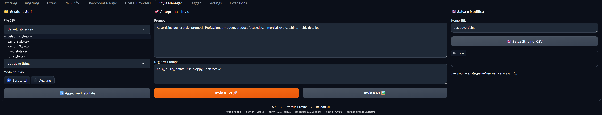
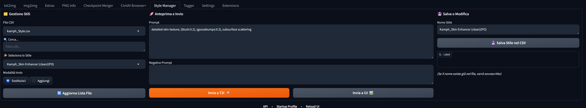
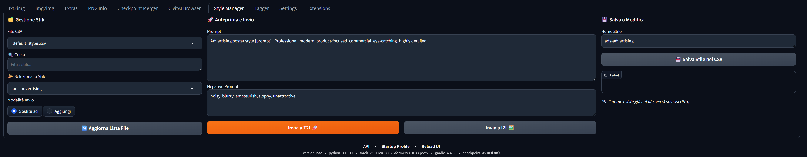
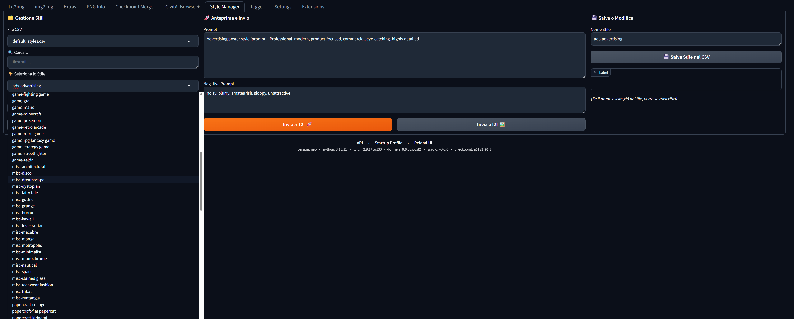

# SD Forge Multi Style Manager

An advanced Style Manager for **Stable Diffusion Forge** (compatible with Automatic1111) that allows you to manage multiple CSV files, edit styles on the fly, and seamlessly integrate with "Prompt All-in-One".

Un gestore di stili avanzato per **Stable Diffusion Forge** (compatibile con Automatic1111) che ti permette di gestire più file CSV, modificare gli stili al volo e integrarsi perfettamente con "Prompt All-in-One".

---

## 🌍 Language / Lingua
[English](#english-description) | [Italiano](#descrizione-italiana)

---

## 🇬🇧 English Description

### ✨ Features
- **Multi-CSV Support:** Load different style libraries from multiple files.
- **Dynamic Search:** Instantly filter hundreds of styles using the search bar.
- **Editor Integration:** Edit existing styles or save new prompts directly into your CSV files without leaving the UI.
- **Smart Send:** Choose between **Replace** (overwrite current prompt) or **Append** (add style to your current text).
- **Pro Compatibility:** Specifically designed to work with the "Prompt All-in-One" (Physton) extension.

### 📸 Screenshots

*Interface overview and CSV selection*

*Filtering styles with the real-time search bar*

*Editing a prompt and saving it back to the CSV*

*Perfect integration with tag-based prompt editors*

### 🚀 Installation
1. Open Stable Diffusion Forge/WebUI.
2. Go to the **Extensions** tab.
3. Select **Install from URL**.
4. Paste the URL of this repository and click **Install**.
5. Restart the UI.

---

## 🇮🇹 Descrizione Italiana

### ✨ Funzionalità
- **Supporto Multi-CSV:** Carica diverse librerie di stili da più file separati.
- **Ricerca Dinamica:** Filtra istantaneamente centinaia di stili tramite la barra di ricerca in tempo reale.
- **Editor Integrato:** Modifica gli stili esistenti o salvane di nuovi direttamente nei file CSV senza uscire dall'interfaccia.
- **Invio Intelligente:** Scegli tra **Sostituisci** (sovrascrivi il prompt attuale) o **Aggiungi** (concatena lo stile al tuo testo).
- **Compatibilità Pro:** Progettato specificamente per funzionare insieme all'estensione "Prompt All-in-One" (Physton).

### 📸 Screenshot

*Panoramica dell'interfaccia e selezione dei file*

*Filtrare gli stili con la ricerca dinamica*

*Modificare un prompt e salvarlo nel CSV*

*Integrazione perfetta con i tag di Prompt All-in-One*

### 🚀 Installazione
1. Apri Stable Diffusion Forge/WebUI.
2. Vai nel tab **Extensions**.
3. Seleziona **Install from URL**.
4. Incolla l'URL di questo repository e clicca su **Install**.
5. Riavvia l'interfaccia (Restart UI).

---

## 🤝 Compatibility Note / Nota di Compatibilità
If you use **Prompt All-in-One**, ensure that the "Monitor native input box" option is enabled in its settings for the best experience.

Se usi **Prompt All-in-One**, assicurati che l'opzione "Monitor native input box" sia attiva nelle sue impostazioni per un'esperienza ottimale.